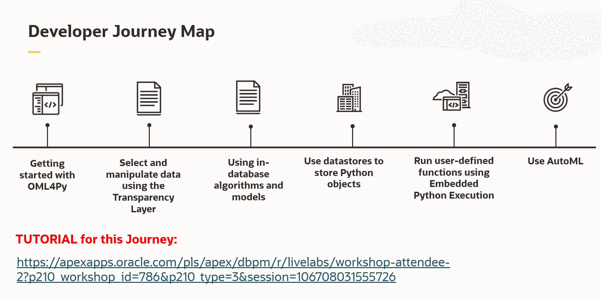

# OML4PY-HOL
Oracle Python Machine Learning Workshop in Autonomous Database

## Introduction
Explore how to build Python Code in Oracle Autonomous Database.

## About this workshop 

This workshop walks you through the steps to build Python Code residing in Oracle Autonomous Database.

The tutorial of LiveLabs can be found <a href="https://apexapps.oracle.com/pls/apex/dbpm/r/livelabs/workshop-attendee-2?p210_workshop_id=786&p210_type=3&session=106708031555726">here</a>.

## Workshop Details

To demonstrate the python functionalities, the workshop has been divided in different steps.

The manual to execute the workshop step by step is available
<a href="https://github.com/operard/OML4PY-HOL/blob/main/doc/20210729_DevRel_Python_natwest_HOL2_steps.pdf">here</a>

### Step 1: Get started with OML4Py on Oracle Autonomous Database.

### Step 2: Select and manipulate data using the transparency layer.

### Step 3: Use in-database algorithms and models.

### Step 4: Use Datastores to store Python objects.

### Step 5: Run user-defined functions using Embedded Python Execution.

### Step 6: Use AutoML.

## Conclusions

## More Examples

